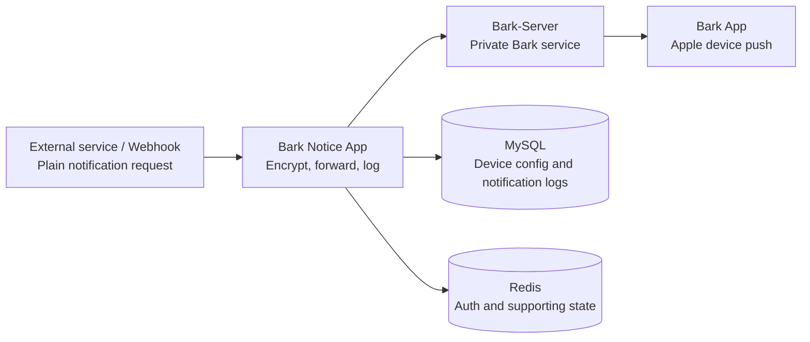
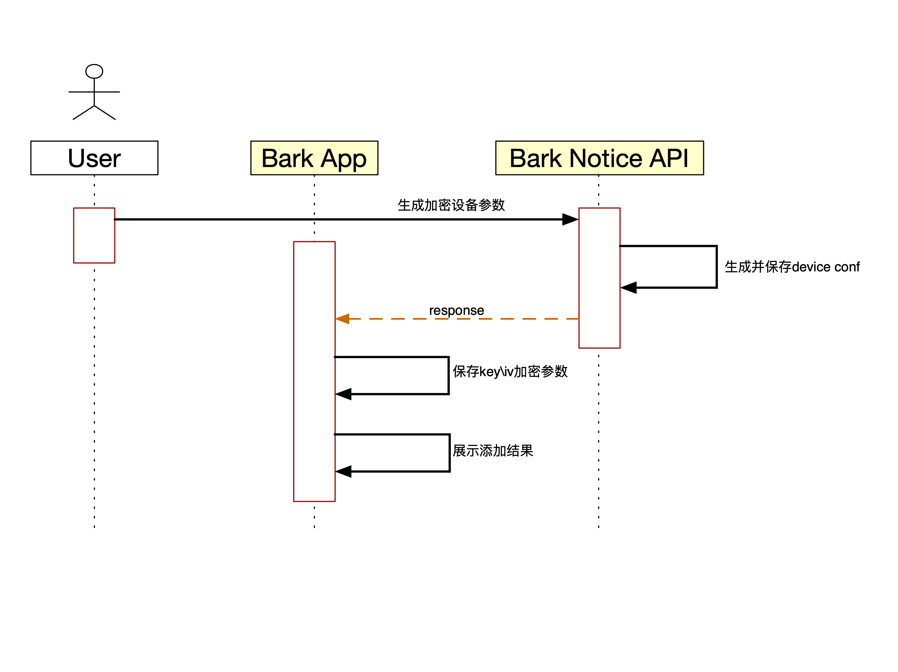
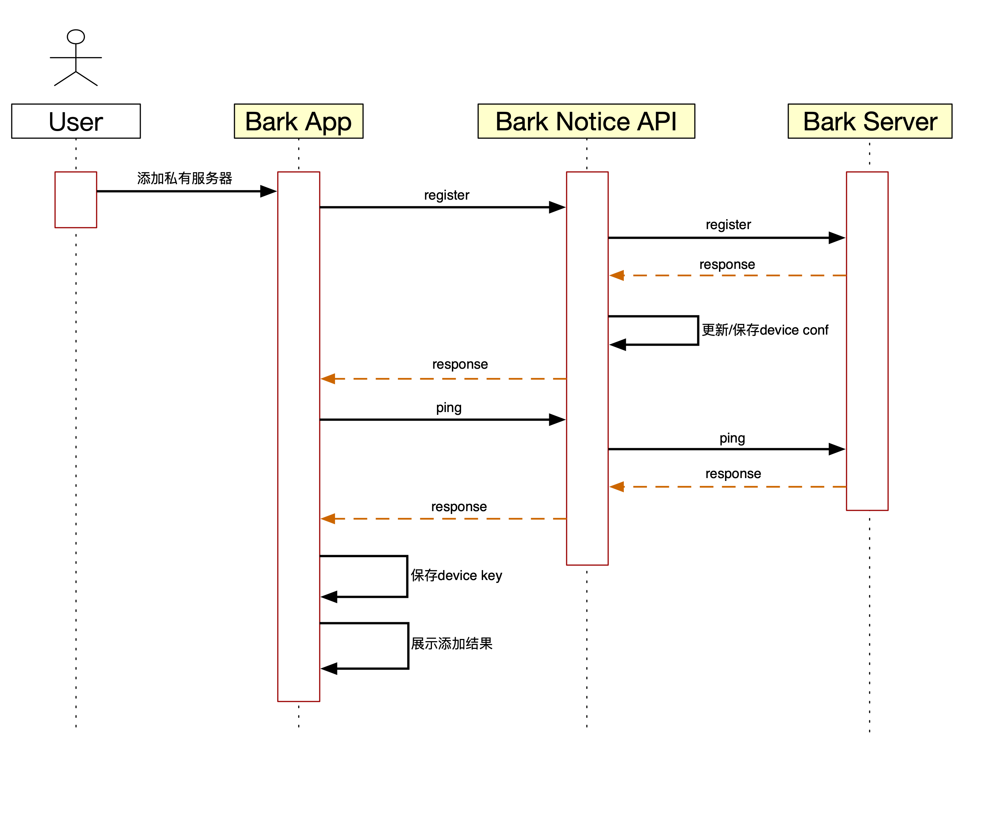
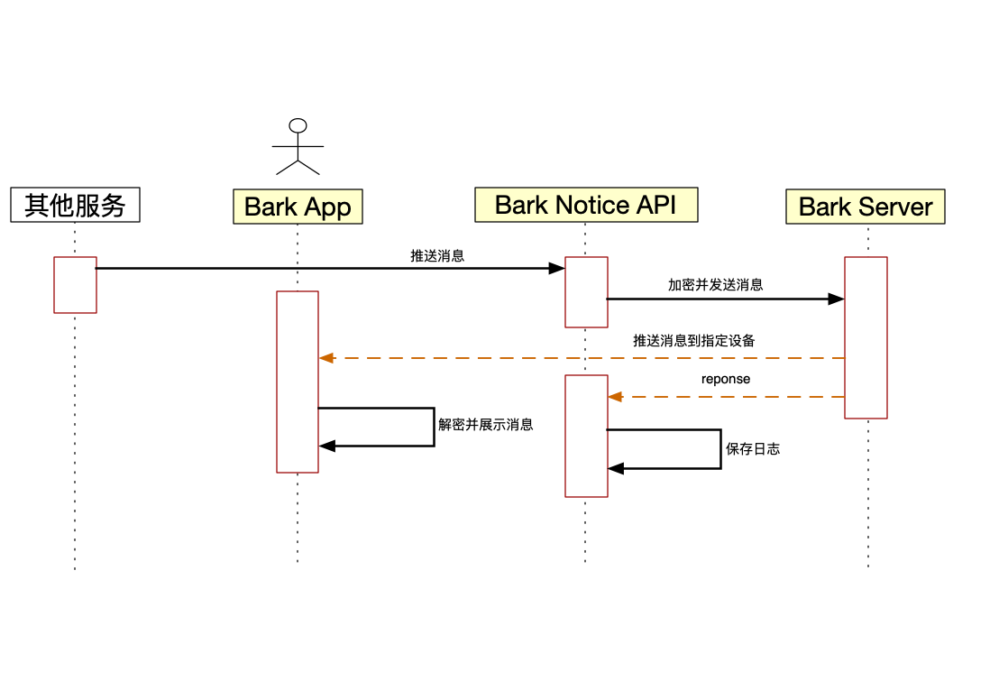

# Bark Notice App

<p align="center">
  <strong>A private Bark-Server notification gateway built with Spring Boot.</strong>
</p>

<p align="center">
  English | <a href="./README.md">中文</a>
</p>

<p align="center">
  
  
  
  
  
</p>

## Contents

- [Overview](#overview)
- [Features](#features)
- [How It Works](#how-it-works)
- [Quick Start](#quick-start)
- [Device Setup](#device-setup)
- [API Reference](#api-reference)
- [Jellyfin Integration](#jellyfin-integration)
- [Status Endpoint](#status-endpoint)
- [Local Development](#local-development)
- [Screenshots](#screenshots)
- [Credits](#credits)

## Overview

Thanks to the open-source [Bark](https://github.com/Finb/Bark) and [Bark-Server](https://github.com/Finb/bark-server) projects, Apple devices can receive real-time private notifications with a lightweight setup. Compared with webhook tools such as DingTalk or ServerChan, Bark is flexible and friendly for self-hosted automation.

`bark-notice-app` works as an API gateway in front of Bark-Server. External services send plain requests to this app, then the app encrypts notification content, forwards it to Bark-Server, records delivery logs, and provides multi-device management, Jellyfin integration, and a web admin UI.

## Features

| Feature | Description |
| --- | --- |
| Plain webhook input | External services send plain requests, and the server encrypts them before forwarding to Bark-Server |
| Multi-device management | Manage device configuration, activation, and deactivation |
| Notification logs | Record notification requests and delivery results for troubleshooting |
| Admin frontend | Provide a Vue-based admin UI |
| Jellyfin integration | Include Jellyfin webhook templates and a dedicated Jellyfin endpoint |
| Status endpoint | Expose a homepage custom API compatible status endpoint |
| Docker deployment | Run frontend and backend in one Docker container |

## How It Works



External services call the `/notice` endpoint to send notifications. The app loads configured devices, encrypts each message with the corresponding device settings, then calls Bark-Server to deliver the push.

## Quick Start

### Prerequisites

| Service | Description |
| --- | --- |
| Bark App | Install Bark App from the App Store |
| Bark-Server | Deploy the native Bark-Server first |
| MySQL | Create the `notice-api` database and initialize tables |
| Redis | Used for authentication, captcha, and supporting state |

Bark-Server deployment guide: <https://bark.day.app/#/deploy>

### Initialize Database

Create the database and import `notice-api.sql` before the first deployment. The script recreates tables, so only use it for first-time initialization.

```sql
CREATE DATABASE IF NOT EXISTS `notice-api`
  DEFAULT CHARACTER SET utf8mb4
  DEFAULT COLLATE utf8mb4_general_ci;
```

```bash
mysql -u <mysql-user> -p notice-api < notice-api.sql
```

### Docker Compose Recommended

`BARK_SERVER_URL` must be reachable from inside the container. Use `host.docker.internal` when Bark-Server is on the host, or use the compose service name when both services share a Docker network.

```yaml
services:
  bark-notice-app:
    image: ballen2270/bark-notice-app:latest
    container_name: bark-notice-app
    restart: always
    ports:
      - "3000:3000" # admin frontend
      - "8080:8080" # backend API
    environment:
      SPRING_PROFILES_ACTIVE: pro
      MYSQL_HOST_NAME: mysql
      MYSQL_PORT: 3306
      MYSQL_USERNAME: root
      MYSQL_PASSWORD: root
      BARK_SERVER_URL: http://host.docker.internal:9988
      BARK_SERVER_TOKEN: replace-with-your-api-token
      REDIS_URL: redis
      REDIS_PORT: 6379
      REDIS_PASSWORD: redis
      TZ: Asia/Shanghai
```

After deployment:

- Admin frontend: `http://<host>:3000`
- Backend API: `http://<host>:8080`
- API through frontend proxy: `http://<host>:3000/api`

### Docker Run

```bash
docker run -d --name bark-notice-app \
  --restart always \
  -p 3000:3000 \
  -p 8080:8080 \
  -e SPRING_PROFILES_ACTIVE=pro \
  -e MYSQL_HOST_NAME=127.0.0.1 \
  -e MYSQL_PORT=3306 \
  -e MYSQL_USERNAME=root \
  -e MYSQL_PASSWORD=root \
  -e BARK_SERVER_URL=http://host.docker.internal:9988 \
  -e BARK_SERVER_TOKEN=replace-with-your-api-token \
  -e REDIS_URL=127.0.0.1 \
  -e REDIS_PORT=6379 \
  -e REDIS_PASSWORD=redis \
  -e TZ=Asia/Shanghai \
  ballen2270/bark-notice-app:latest
```

### Environment Variables

| Variable | Description |
| --- | --- |
| `SPRING_PROFILES_ACTIVE` | Use `pro` for production |
| `MYSQL_HOST_NAME` | MySQL hostname or service name |
| `MYSQL_PORT` | MySQL port |
| `MYSQL_USERNAME` | MySQL username |
| `MYSQL_PASSWORD` | MySQL password |
| `BARK_SERVER_URL` | Bark-Server URL |
| `BARK_SERVER_TOKEN` | Token used by the status endpoint |
| `REDIS_URL` | Redis hostname or service name |
| `REDIS_PORT` | Redis port |
| `REDIS_PASSWORD` | Redis password |
| `TZ` | Container timezone |

## Device Setup

### 1. Add Private Server

1. Open Bark App and tap the plus button.
2. Enter your deployed `bark-notice-app` URL, for example `https://notice.example.com`.
3. After saving, Bark App shows the private server URL and `DeviceKey`.
4. Open Bark App settings and copy `DeviceToken`. Keep it private.

### 2. Generate Encryption Config

Using the admin frontend is recommended. If you call the API directly, management endpoints may require a JWT from login.

```bash
export BASE_URL="https://notice.example.com"
export JWT_TOKEN="<jwt-token-if-required>"

curl --request POST "$BASE_URL/device/gen" \
  --header "Content-Type: application/json" \
  --header "Authorization: Bearer $JWT_TOKEN" \
  --data '{
    "deviceToken": "DeviceToken copied from Bark App settings",
    "name": "iPhone",
    "deviceKey": "DeviceKey shown in Bark App private server URL",
    "algorithm": "AES",
    "model": "CBC",
    "padding": "PKCS7Padding",
    "encodeKey": "",
    "iv": ""
  }'
```

When `encodeKey` and `iv` are empty, `bark-notice-app` generates them automatically.

### 3. Configure Bark App Encryption

Pull down on the Bark App home page and open encryption settings:

| Setting | Value |
| --- | --- |
| Algorithm | `AES256` |
| Mode | `CBC` |
| Padding | `pkcs7` |
| Key | Use returned `encodeKey` |
| iv | Use returned `iv` |

Tap Done in the upper-right corner. Bark App sends test requests, so keep the service available.

### 4. Send a Test Notification

```bash
curl --request POST "$BASE_URL/notice" \
  --header "Content-Type: application/json" \
  --data '{
    "title": "test title",
    "body": "msg body",
    "group": "test",
    "url": "https://example.com"
  }'
```

## API Reference

### Standard Response

```json
{
  "code": "000000",
  "msg": "发送成功",
  "data": {
    "sendNum": 1,
    "successNum": 1
  }
}
```

### Notification APIs

| Method | Path | Description |
| --- | --- | --- |
| `GET` | `/ping` | Proxy Bark-Server ping |
| `GET` | `/notice?title={title}&body={body}&group={group}` | Send notification |
| `GET` | `/notice/{title}/{body}?group={group}` | Send notification with path parameters |
| `POST` | `/notice` | Send notification with JSON body |

`POST /notice` request body:

```json
{
  "title": "title",
  "body": "body",
  "group": "group",
  "url": "https://example.com"
}
```

### Bark Registration API

| Method | Path | Description |
| --- | --- | --- |
| `GET` | `/register?devicetoken={deviceToken}&key={key}` | Forward Bark App registration and store DeviceKey |

### Device APIs

These endpoints manage device configuration. Include `Authorization: Bearer <token>` when JWT protection is enabled.

| Method | Path | Description |
| --- | --- | --- |
| `GET` | `/device/query?deviceToken={deviceToken}` | Query one device |
| `GET` | `/device/queryAll` | Query all devices |
| `POST` | `/device/gen` | Generate or update device encryption config |
| `GET` | `/device/active?deviceToken={deviceToken}` | Activate device |
| `GET` | `/device/stop?deviceToken={deviceToken}` | Stop device |

### Auth APIs

| Method | Path | Description |
| --- | --- | --- |
| `GET` | `/auth/checkInit` | Check whether the system is initialized |
| `POST` | `/auth/initRegister` | Initialize admin account |
| `POST` | `/auth/login` | Login and return JWT |
| `GET` | `/auth/info` | Get current user info |
| `POST` | `/auth/changePassword` | Change password |

## Jellyfin Integration

### Generic Webhook

1. Install the Webhook plugin from the Jellyfin plugin catalog.
2. Add a Generic Destination.
3. Set URL to `http://<host>:8080/notice`.
4. Add request header: `Content-Type: application/json`.
5. Select notification types such as `Playback Start` and `Playback Stop`.

Template example:

```json
{
  "group": "Jellyfin",
  "title": "Jellyfin {{NotificationType}}",
  "body": "User: {{NotificationUsername}}\nMedia: {{{Name}}}\nDevice: {{DeviceName}}"
}
```

### Dedicated Jellyfin Endpoint

This mode is easier to configure and currently supports item added, playback start, and playback stop notifications.

Webhook URL:

```text
http://<host>:8080/jellyfin/notice
```

Template:

```json
{
  "notificationType": "{{{NotificationType}}}",
  "itemType": "{{{ItemType}}}",
  "seriesName": "{{{SeriesName}}}",
  "seasonNumber": "{{SeasonNumber00}}",
  "episodeNumber": "{{EpisodeNumber00}}",
  "name": "{{{Name}}}",
  "year": "{{Year}}",
  "deviceName": "{{{DeviceName}}}",
  "notificationUsername": "{{{NotificationUsername}}}"
}
```

## Status Endpoint

`/status/endpoint` can be used as a homepage custom API. Send `API-TOKEN` in the request header, and its value must match `BARK_SERVER_TOKEN`.

```bash
curl --request GET "http://<host>:8080/status/endpoint" \
  --header "API-TOKEN: replace-with-your-api-token"
```

Response example:

```json
{
  "status": "在线",
  "activeDeviceNum": 1,
  "allDeviceNum": 2
}
```

homepage example:

```yaml
- WebHook:
    - Bark Notice App:
        icon: barknoticeapp.png
        href: https://notice.example.com
        widget:
          type: customapi
          url: http://127.0.0.1:8080/status/endpoint
          refreshInterval: 10000
          method: GET
          headers:
            API-TOKEN: replace-with-your-api-token
          mappings:
            - field: status
              label: Service Status
            - field: activeDeviceNum
              label: Active Devices
              format: number
            - field: allDeviceNum
              label: Total Devices
              format: number
```

## Local Development

### Backend

```bash
mvn clean package -DskipTests
java -Dspring.profiles.active=dev -jar target/notice-api.jar
```

Default backend port: `8080`

### Frontend

```bash
npm --prefix frontend install
npm --prefix frontend run dev
```

Default frontend port: `3000`

In development, frontend `/api` requests are proxied to `http://localhost:8080`.

### Build Docker Image

```bash
docker build -t bark-notice-app:latest .
```

## Screenshots

| Generate device config | Add private server | Push message |
| --- | --- | --- |
|  |  |  |

## Credits

This project is built on top of the Bark ecosystem. Thanks to the Bark author and community for their open-source work. The app is mainly designed for private personal notification scenarios, so adjust security rules, database accounts, and access control for your own deployment.

- Bark: <https://github.com/Finb/Bark>
- Bark-Server: <https://github.com/Finb/bark-server>
- Bark deploy guide: <https://bark.day.app/#/deploy>
