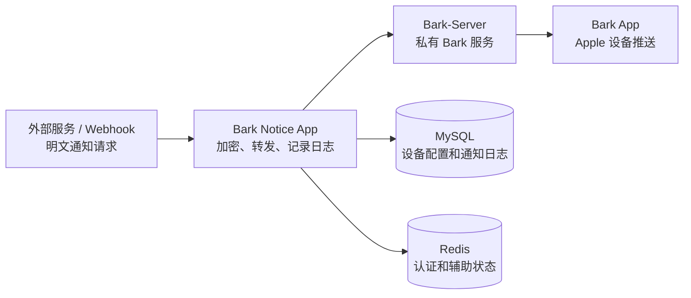

# Bark Notice App

<p align="center">
  <strong>一个基于 Spring Boot 的 Bark-Server 私有推送网关</strong>
</p>

<p align="center">
  <a href="./README.en.md">English</a> | 中文
</p>

<p align="center">
  
  
  
  
  
</p>

## 目录

- [项目简介](#项目简介)
- [核心能力](#核心能力)
- [工作原理](#工作原理)
- [快速开始](#快速开始)
- [设备配置](#设备配置)
- [API 参考](#api-参考)
- [Jellyfin 接入](#jellyfin-接入)
- [状态接口](#状态接口)
- [本地开发](#本地开发)
- [截图](#截图)
- [致谢](#致谢)

## 项目简介

非常感谢 [Bark](https://github.com/Finb/Bark) 和 [Bark-Server](https://github.com/Finb/bark-server) 的开源工作，让 Apple 设备可以方便地接收实时推送。相比钉钉、Server 酱等 webhook 工具，Bark 的自由度和私有化能力更适合个人自动化场景。

`bark-notice-app` 在 Bark-Server 外层增加了一层 API 网关：外部系统只需要发送明文请求，本服务会把通知内容加密后转发给 Bark-Server，同时记录通知日志，并提供多设备配置、Jellyfin 通知和前端管理页面。

## 核心能力

| 能力 | 说明 |
| --- | --- |
| 明文 webhook 入站 | 外部系统直接发送明文请求，服务端负责加密转发到 Bark-Server |
| 多设备管理 | 支持设备配置、启用和停用 |
| 通知日志 | 记录通知请求和推送结果，便于排查问题 |
| 前端管理页 | 提供 Vue 管理页面 |
| Jellyfin 接入 | 内置 Jellyfin webhook 模板和专用接口 |
| 状态接口 | 提供 homepage custom API 兼容的状态接口 |
| Docker 部署 | 前端和后端可在同一个 Docker 容器中运行 |

## 工作原理



外部服务调用 `bark-notice-app` 的 `/notice` 接口即可发送通知。服务会读取已配置的设备列表，将消息按设备加密，再调用 Bark-Server 完成推送。

## 快速开始

### 依赖服务

| 项目 | 说明 |
| --- | --- |
| Bark App | 从 App Store 安装 Bark App |
| Bark-Server | 需要先部署原生 Bark-Server |
| MySQL | 创建 `notice-api` 数据库并初始化表结构 |
| Redis | 用于认证、验证码和辅助状态 |

Bark-Server 部署文档：<https://bark.day.app/#/deploy>

### 初始化数据库

首次部署前创建数据库，并导入 `notice-api.sql`。该脚本会重建表结构，只建议在首次初始化时执行。

```sql
CREATE DATABASE IF NOT EXISTS `notice-api`
  DEFAULT CHARACTER SET utf8mb4
  DEFAULT COLLATE utf8mb4_general_ci;
```

```bash
mysql -u <mysql-user> -p notice-api < notice-api.sql
```

### Docker Compose 推荐

`BARK_SERVER_URL` 必须是容器内部可以访问到的 Bark-Server 地址。如果 Bark-Server 在宿主机上，通常可以使用 `host.docker.internal`；如果在同一个 compose 网络中，使用服务名。

```yaml
services:
  bark-notice-app:
    image: ballen2270/bark-notice-app:latest
    container_name: bark-notice-app
    restart: always
    ports:
      - "3000:3000" # 前端管理页
      - "8080:8080" # 后端接口
    environment:
      SPRING_PROFILES_ACTIVE: pro
      MYSQL_HOST_NAME: mysql
      MYSQL_PORT: 3306
      MYSQL_USERNAME: root
      MYSQL_PASSWORD: root
      BARK_SERVER_URL: http://host.docker.internal:9988
      BARK_SERVER_TOKEN: replace-with-your-api-token
      REDIS_URL: redis
      REDIS_PORT: 6379
      REDIS_PASSWORD: redis
      TZ: Asia/Shanghai
```

部署后访问：

- 前端管理页：`http://<host>:3000`
- 后端 API：`http://<host>:8080`
- 前端代理 API：`http://<host>:3000/api`

### Docker Run

```bash
docker run -d --name bark-notice-app \
  --restart always \
  -p 3000:3000 \
  -p 8080:8080 \
  -e SPRING_PROFILES_ACTIVE=pro \
  -e MYSQL_HOST_NAME=127.0.0.1 \
  -e MYSQL_PORT=3306 \
  -e MYSQL_USERNAME=root \
  -e MYSQL_PASSWORD=root \
  -e BARK_SERVER_URL=http://host.docker.internal:9988 \
  -e BARK_SERVER_TOKEN=replace-with-your-api-token \
  -e REDIS_URL=127.0.0.1 \
  -e REDIS_PORT=6379 \
  -e REDIS_PASSWORD=redis \
  -e TZ=Asia/Shanghai \
  ballen2270/bark-notice-app:latest
```

### 环境变量

| 变量 | 说明 |
| --- | --- |
| `SPRING_PROFILES_ACTIVE` | 生产环境使用 `pro` |
| `MYSQL_HOST_NAME` | MySQL 主机名或服务名 |
| `MYSQL_PORT` | MySQL 端口 |
| `MYSQL_USERNAME` | MySQL 用户名 |
| `MYSQL_PASSWORD` | MySQL 密码 |
| `BARK_SERVER_URL` | Bark-Server 地址 |
| `BARK_SERVER_TOKEN` | 状态接口鉴权 token |
| `REDIS_URL` | Redis 主机名或服务名 |
| `REDIS_PORT` | Redis 端口 |
| `REDIS_PASSWORD` | Redis 密码 |
| `TZ` | 容器时区 |

## 设备配置

### 1. 添加私有服务器

1. 打开 Bark App，点击右上角加号。
2. 填入已经部署好的 `bark-notice-app` URL，例如 `https://notice.example.com`。
3. 保存后，Bark App 会显示私人服务器 URL 和 `DeviceKey`。
4. 进入 Bark App 设置页，复制 `DeviceToken`。请妥善保存，不要泄露。

### 2. 生成加密配置

推荐通过前端管理页添加设备。如果直接调用接口，管理类接口可能需要登录后的 JWT。

```bash
export BASE_URL="https://notice.example.com"
export JWT_TOKEN="<jwt-token-if-required>"

curl --request POST "$BASE_URL/device/gen" \
  --header "Content-Type: application/json" \
  --header "Authorization: Bearer $JWT_TOKEN" \
  --data '{
    "deviceToken": "DeviceToken copied from Bark App settings",
    "name": "iPhone",
    "deviceKey": "DeviceKey shown in Bark App private server URL",
    "algorithm": "AES",
    "model": "CBC",
    "padding": "PKCS7Padding",
    "encodeKey": "",
    "iv": ""
  }'
```

`encodeKey` 和 `iv` 为空时由 `bark-notice-app` 自动生成。

### 3. 配置 Bark App 加密

在 Bark App 首页下拉进入加密设置：

| 设置项 | 值 |
| --- | --- |
| 算法 | `AES256` |
| 模式 | `CBC` |
| Padding | `pkcs7` |
| Key | 使用接口返回的 `encodeKey` |
| iv | 使用接口返回的 `iv` |

点击右上角完成。Bark App 会发送测试请求，请保持服务可用。

### 4. 发送测试消息

```bash
curl --request POST "$BASE_URL/notice" \
  --header "Content-Type: application/json" \
  --data '{
    "title": "test title",
    "body": "msg body",
    "group": "test",
    "url": "https://example.com"
  }'
```

## API 参考

### 通用返回格式

```json
{
  "code": "000000",
  "msg": "发送成功",
  "data": {
    "sendNum": 1,
    "successNum": 1
  }
}
```

### 通知接口

| 方法 | 路径 | 说明 |
| --- | --- | --- |
| `GET` | `/ping` | 透传 Bark-Server ping |
| `GET` | `/notice?title={title}&body={body}&group={group}` | 发送通知 |
| `GET` | `/notice/{title}/{body}?group={group}` | 路径参数方式发送通知 |
| `POST` | `/notice` | JSON 方式发送通知 |

`POST /notice` 请求体：

```json
{
  "title": "title",
  "body": "body",
  "group": "group",
  "url": "https://example.com"
}
```

### Bark 注册接口

| 方法 | 路径 | 说明 |
| --- | --- | --- |
| `GET` | `/register?devicetoken={deviceToken}&key={key}` | 转发 Bark App 注册请求并保存 DeviceKey |

### 设备接口

这些接口用于管理设备配置。若开启 JWT 保护，请带上 `Authorization: Bearer <token>`。

| 方法 | 路径 | 说明 |
| --- | --- | --- |
| `GET` | `/device/query?deviceToken={deviceToken}` | 查询单个设备 |
| `GET` | `/device/queryAll` | 查询所有设备 |
| `POST` | `/device/gen` | 生成或更新设备加密配置 |
| `GET` | `/device/active?deviceToken={deviceToken}` | 启用设备 |
| `GET` | `/device/stop?deviceToken={deviceToken}` | 停用设备 |

### 认证接口

| 方法 | 路径 | 说明 |
| --- | --- | --- |
| `GET` | `/auth/checkInit` | 检查系统是否已初始化 |
| `POST` | `/auth/initRegister` | 初始化管理员账号 |
| `POST` | `/auth/login` | 登录并返回 JWT |
| `GET` | `/auth/info` | 获取当前用户信息 |
| `POST` | `/auth/changePassword` | 修改密码 |

## Jellyfin 接入

### 通用 webhook

1. 在 Jellyfin 插件目录中安装 Webhook 插件。
2. 添加 Generic Destination。
3. URL 填写 `http://<host>:8080/notice`。
4. 添加请求头：`Content-Type: application/json`。
5. Notification Type 可选择 `Playback Start`、`Playback Stop` 等。

模板示例：

```json
{
  "group": "Jellyfin",
  "title": "Jellyfin {{NotificationType}}",
  "body": "用户：{{NotificationUsername}}\n媒体：{{{Name}}}\n设备：{{DeviceName}}"
}
```

### 专用 Jellyfin 接口

该方式配置更简单，当前支持媒体增加、开始播放、暂停播放等通知类型。

Webhook URL:

```text
http://<host>:8080/jellyfin/notice
```

Template:

```json
{
  "notificationType": "{{{NotificationType}}}",
  "itemType": "{{{ItemType}}}",
  "seriesName": "{{{SeriesName}}}",
  "seasonNumber": "{{SeasonNumber00}}",
  "episodeNumber": "{{EpisodeNumber00}}",
  "name": "{{{Name}}}",
  "year": "{{Year}}",
  "deviceName": "{{{DeviceName}}}",
  "notificationUsername": "{{{NotificationUsername}}}"
}
```

## 状态接口

`/status/endpoint` 可用于 homepage 的 custom API。请求时需要在 header 中传入 `API-TOKEN`，其值与 `BARK_SERVER_TOKEN` 一致。

```bash
curl --request GET "http://<host>:8080/status/endpoint" \
  --header "API-TOKEN: replace-with-your-api-token"
```

返回示例：

```json
{
  "status": "在线",
  "activeDeviceNum": 1,
  "allDeviceNum": 2
}
```

homepage 配置示例：

```yaml
- WebHook:
    - Bark Notice App:
        icon: barknoticeapp.png
        href: https://notice.example.com
        widget:
          type: customapi
          url: http://127.0.0.1:8080/status/endpoint
          refreshInterval: 10000
          method: GET
          headers:
            API-TOKEN: replace-with-your-api-token
          mappings:
            - field: status
              label: 服务状态
            - field: activeDeviceNum
              label: 活跃设备数
              format: number
            - field: allDeviceNum
              label: 总设备数
              format: number
```

## 本地开发

### 后端

```bash
mvn clean package -DskipTests
java -Dspring.profiles.active=dev -jar target/notice-api.jar
```

默认后端端口：`8080`

### 前端

```bash
npm --prefix frontend install
npm --prefix frontend run dev
```

默认前端端口：`3000`

开发环境中，前端 `/api` 会代理到 `http://localhost:8080`。

### Docker 镜像构建

```bash
docker build -t bark-notice-app:latest .
```

## 截图

| 生成加密设备配置 | 添加私有服务器 | 推送消息 |
| --- | --- | --- |
|  |  |  |

## 致谢

本项目基于 Bark 生态构建，感谢 Bark 作者和社区的开源贡献。项目主要用于个人私有化推送场景，请按自己的部署环境调整安全策略、数据库账号和访问控制。

- Bark: <https://github.com/Finb/Bark>
- Bark-Server: <https://github.com/Finb/bark-server>
- Bark deploy guide: <https://bark.day.app/#/deploy>
